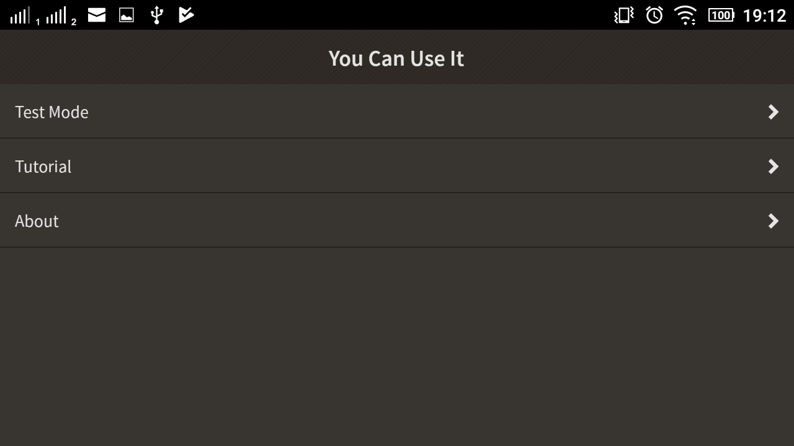
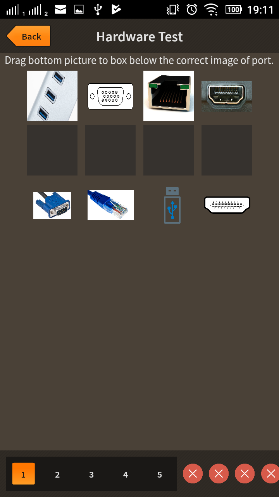
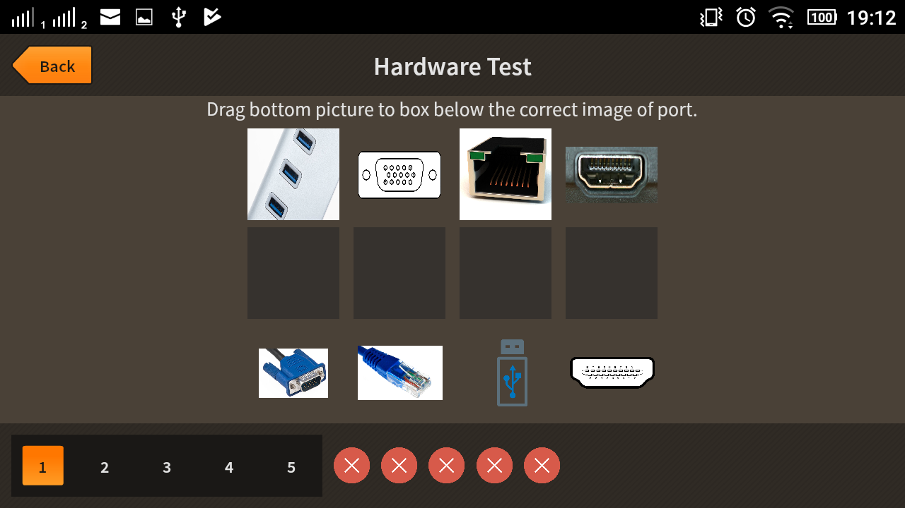
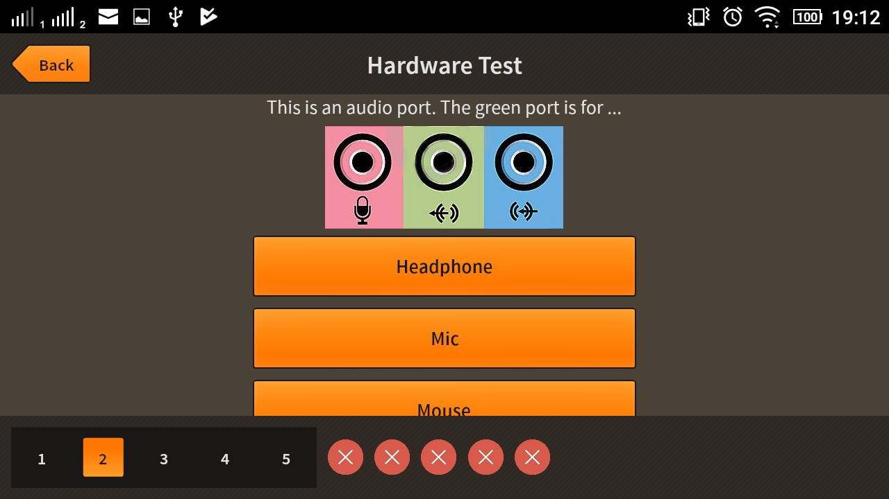
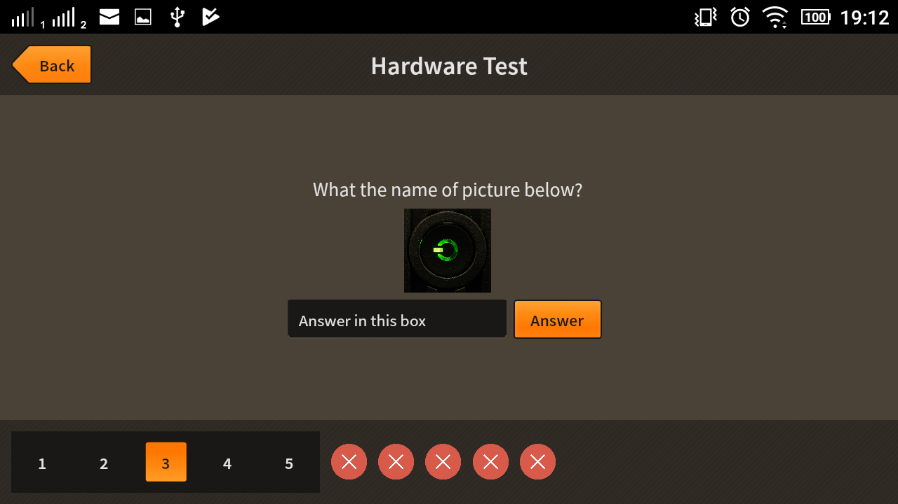
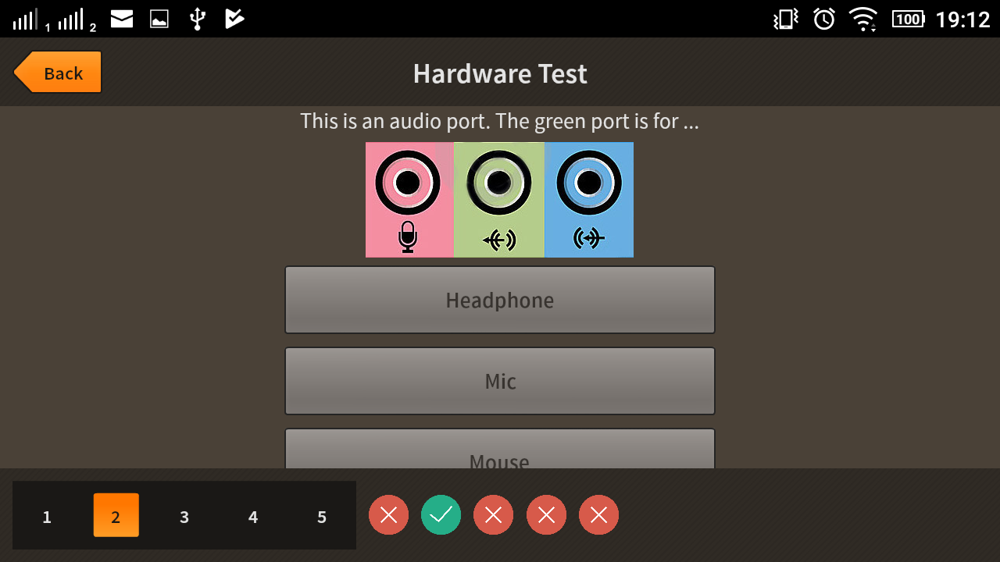
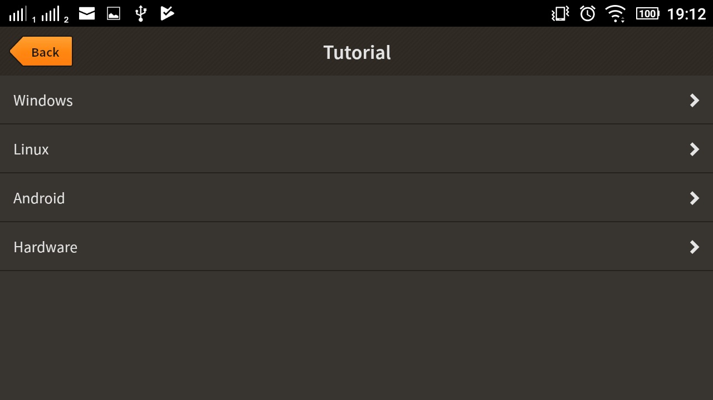
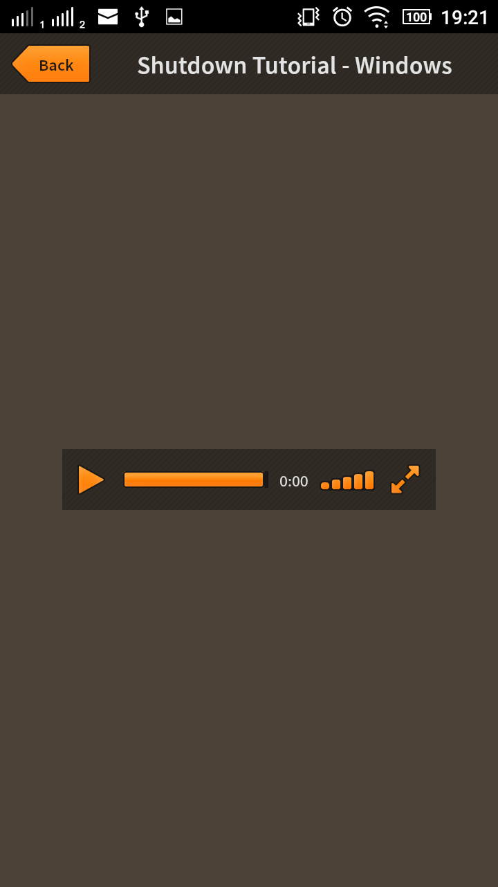
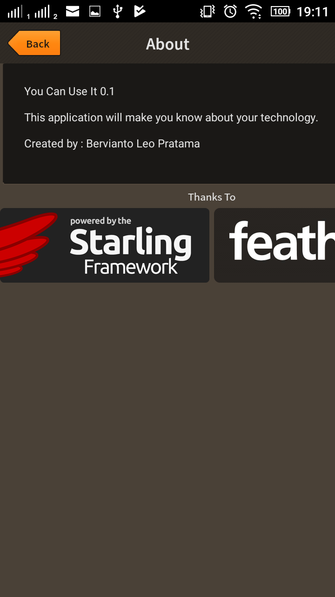
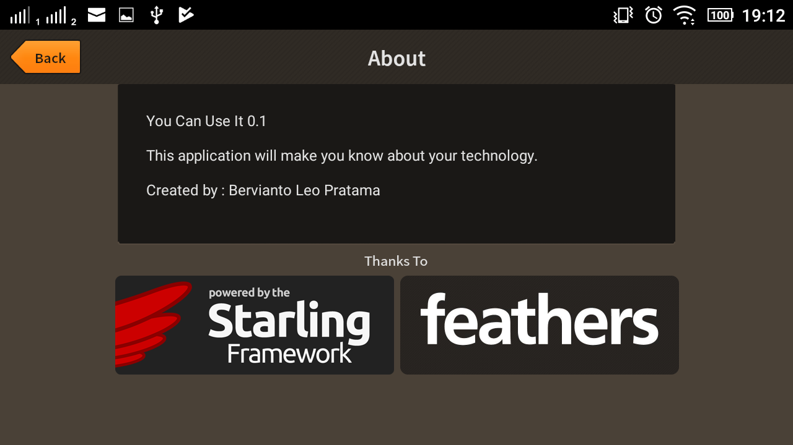

# Starling Education Project

This repository is used to explore Starling Framework.

* About starling is [here](doc/Resume_Starling.md) - Exploration 1.
* Startup Project Starling is [here](startup/) - For documentation is [here](startup/doc/TellYourName.pdf) - Exploration 2.
* Project Proposal is [here](doc/You-Can-Use-It-13514047-Bervianto-Leo-P.pdf) - [revision](doc/You-Can-Use-It-13514047-Bervianto-Leo-P-revisi.pdf).
* Project Draft 1 is [here](draft1/) - Progress Report 1 is [here](doc/ProgressReport1.md).
* Progress Report 2 is [here](doc/ProgressReport2.md).
* Final Project will be in root.
* Project Schedule is [here](doc/Reminder.md).

## Features

### Main Menu




### Test








### Tutorial




### About




## TODO

1. Layout fit to screen (Responsive Design).
2. Add some content (Tutorial) and prepare design of the content.
3. Optimize the using of Gradle.
4. Optimize drag and drop test.
5. Optimize rendering when changed orientation.

---
#### Dependency

* [Starling](http://gamua.com/starling/)
* [FeathersUI](http://feathersui.com/)
* [Hi-Res-Stats](https://github.com/mrdoob/Hi-ReS-Stats)

## LICENSE

````
   Copyright 2017 Bervianto Leo P

   Licensed under the Apache License, Version 2.0 (the "License");
   you may not use this file except in compliance with the License.
   You may obtain a copy of the License at

       http://www.apache.org/licenses/LICENSE-2.0

   Unless required by applicable law or agreed to in writing, software
   distributed under the License is distributed on an "AS IS" BASIS,
   WITHOUT WARRANTIES OR CONDITIONS OF ANY KIND, either express or implied.
   See the License for the specific language governing permissions and
   limitations under the License.
````